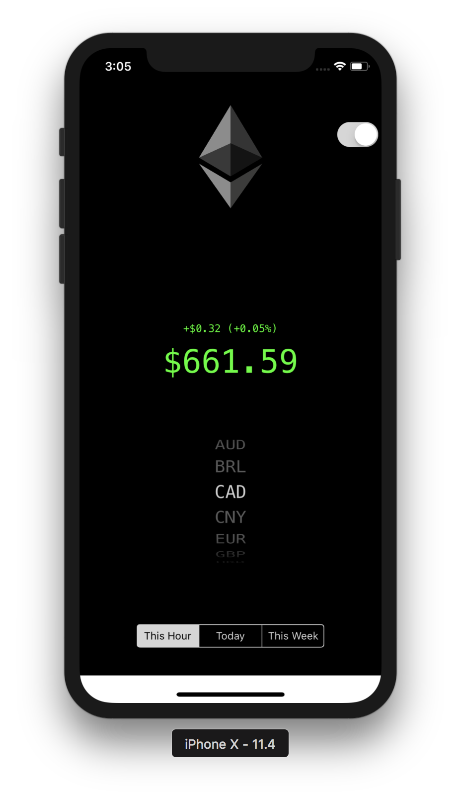

# MyBitStack - v2.0 
### A Cyrptocurrency Tracking iOS application

Single-View iOS application that uses bitcoinaverage.com's API to fetch data on the current value of the Bitcoin/Ethereum cryptocurrencies.

#### Features
* Real-time updates on current value of Bitcoin/Ethereum
* Choice of 19 currencies (including USD, CAD, EUR, GBP)
* Price & Percentage increase/decrease since last hour

#### New in v2.0
* currency increase/decrease now shows as both percentage AND raw amount
* Switch beween Bitcoin and Ethereum!
* Toggle between hourly, daily, and weekly updates

#### Upcoming Features
* Quick-select a currency (e.g. CAD) with one click
* Preferred currency user defaults (core data)
* splash screeen
* UI improvements

#### Screenshots
 
 

#### Instructions

To download this app onto your device, simply download this repository to your local machine, open it with XCode and run it on your device.

#### Credits
I'd like to extend a thank you to LondonAppBrewery's Angela Yu for providing some of the image assets and knowledge used in this project!
